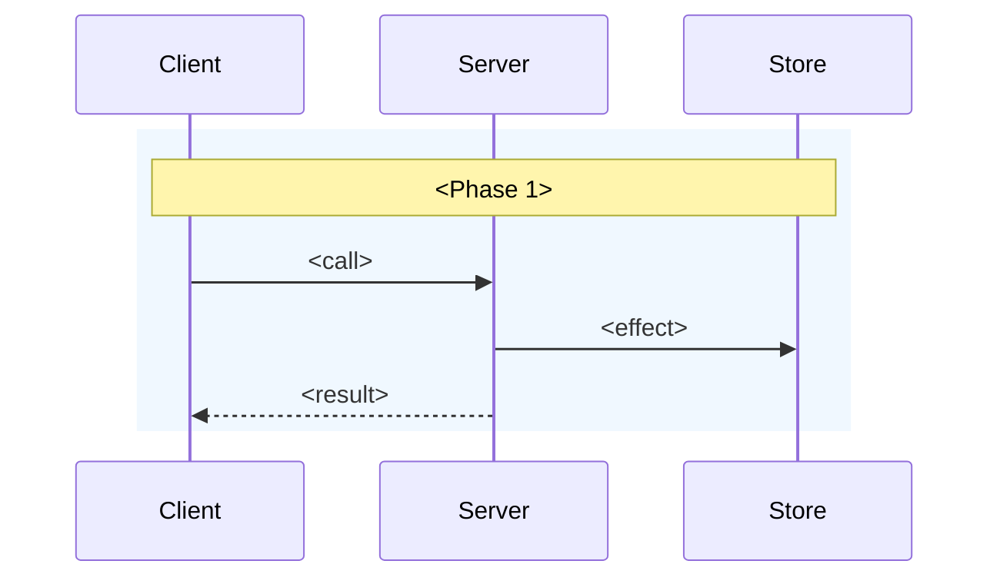

# README Template

Copy this skeleton and fill it in. Drop the sections marked optional when they don't apply. Placeholders are `<angle-bracketed>`.

---

<div align="center">

<picture>
  <source media="(prefers-color-scheme: dark)" srcset="assets/logo-dark.png" />
  <source media="(prefers-color-scheme: light)" srcset="assets/logo-light.png" />
   logo" width="400" />
</picture>

<p align="center"><tagline, under 10 words, matching package.json description></p>
<p align="center">
  <a href="https://www.npmjs.com/package/<package-name>" alt="<package-name>">?label=<package-name>"></a> <a href="https://github.com/<owner>/<repo>/actions/workflows/ci.yml" alt="CI">/<repo>/ci.yml?branch=main"></a>
</p>

</div>

This library provides `<what>` for `<which surface>` in `<the host library, linked>`. `<One more sentence if the first can't carry it.>`

## Why?

`<The host library>` `<does the default thing>`. However, you may want to:

- **`<Pain 1>`**: `<concrete description>`
- **`<Pain 2>`**: `<concrete description>`
- **`<Pain 3>`**: `<concrete description>`

This library provides `<the one-sentence bridge>`.

## Installation

> [!NOTE]
> Version compatibility:
>
> - Use [`<package>@1.x`](https://github.com/<owner>/<repo>/tree/v1.x) for `<Host>` v6
> - Use [`<package>@2.x`](https://github.com/<owner>/<repo>/tree/v2.x) for `<Host>` v7

```bash
npm install <package>@1 # <Host> v6
npm install <package>@2 # <Host> v7
```

`<peer-dep-a>` and `<peer-dep-b>` are peer dependencies.

## How It Works

<!-- Optional. Only when there are real runtime moving parts (multiple processes, a broker,
     a cross-request lifecycle) that a diagram clarifies. Otherwise delete this section. -->



## Usage

`<One or two sentences framing the primary API.>`

```typescript
import { <mainExport> } from '<package>';

/** The minimal happy path: import, construct, call, use. Under 25 lines. */
const thing = <mainExport>({ /* ... */ });

const result = await <use>(thing);
```

### `<Concept 1>`

`<1-3 sentences. What it does and when to reach for it.>`

```typescript
/** Teach in the comments, at the line being explained. */
```

### `<Concept 2>`

`<1-3 sentences.>`

```typescript
```

> [!NOTE]
> `<A caveat, a version requirement, or a "this only affects X".>`

### `<Defaults / Precedence rule>`

`<The rule that governs which setting wins. Give it its own heading — this is what confuses people.>`

**Precedence** (highest to lowest):

1. `<...>`
2. `<...>`
3. `<...>`

## Advanced

<!-- Optional. Escape hatches, telemetry, performance, and honest limitations. -->

### `<Limitation>`

> [!IMPORTANT]
> `<What does not work, why, and what to do instead.>`

## API

### `<exportName>(options)`

```ts
interface <Options> {
  <field>: <Type>;              // <what it does>
  <optional>?: <Type>;          // default: <value>
}
```

`<What it returns. What defaults apply. What rule governs it.>`

```ts
const x = <exportName>({ /* ... */ });
```

### `<builderNamespace>`

`<One line on what the namespace covers.>`

#### `.<method>(args)`

```ts
<namespace>.<method>(args: <Args>): <Return>
// <namespace>.<method>({ a: 1 }): <the literal value it produces>
```

## Types

<!-- Optional. Only for types users must name themselves. -->

### `<TypeName>`

`<What it is and when you'd write it.>`

```ts
import type { <TypeName> } from '<package>';
// <the shape, inline>
```

## License

MIT
